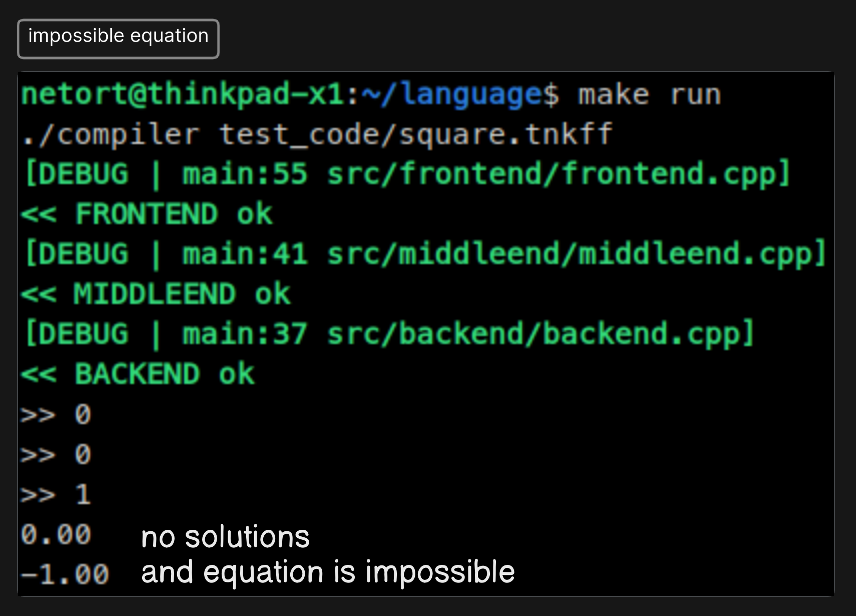
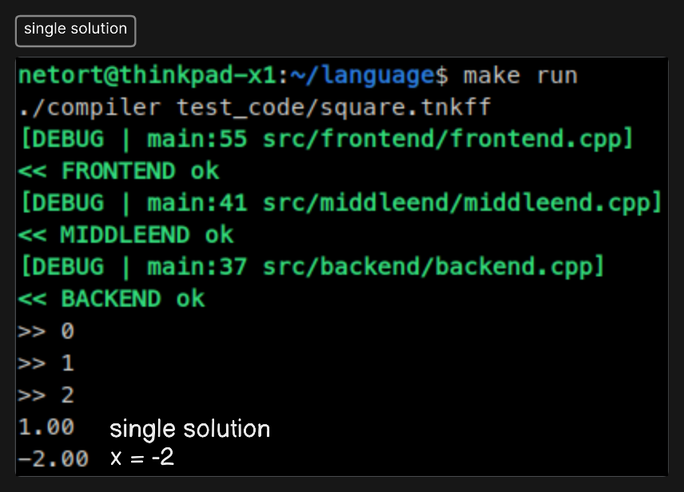
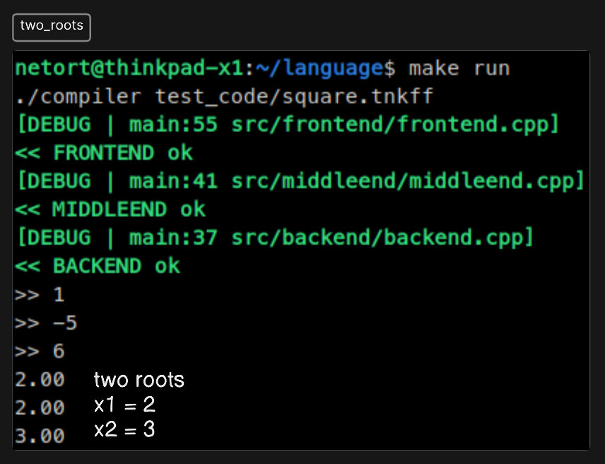

# Компилятор языка программирования TinkovLang

---

## Краткое описание

Разработка данного языка началась в декабре 2023 года, когда в интернете были популярны мемы с нарезками цитат Олега Тинькова из интервью. Этим объясняется синтаксис языка и имена переменных в тестовых программах.

Компилятор представляет собой набор нескольких программ: [frontend](), [middleend](), [backend]().

- [**frontend**]() - выполняет лексический анализ (токенизацию) и строит из токенов абстракное синтаксическое дерево (AST)
- [**middleend**]() - выполняет над AST набор оптимизации
- [**backend**]() - выполняет трансляцию AST в ассемблерный текст (NASM)

Язык поддерживает работу только с целыми числами, но с помощью [некоторых исхищрений]() симулирует операции с плавающей точкой фиксированной точности.

## Установка и первый запуск

1. Клонирование репозитория

    ```
    git clone https://github.com/UjeNeTORT/tinkov_lang.git
    ```

2. Компиляция исходников TinkovLang

    ```
    make
    ```
3. Компиляция дефолтной программы на TinkovLang

    ```
    make compile
    ```
4. Запуск

    ```
    make run
    ```

Введите 3 числа - коэффициенты *a, b, c* квадратного уравнения $ax^2 + bx + c = 0$.

Насладитесь его корнями:

Невозможное уравнение      |  Бесконечно много корней  | Один корень               | Два корня
:-------------------------:|:-------------------------:|:-------------------------:|:-------------------------:
    |    | | 

## Ваша первая программа на TinkovLang

### Исходник

1. Создайте файл с расширением `.tnkff`
2. Вставьте первой же строчкой заголовок

    <details>
    <summary><b>Заголовок, без которого не скомпилируется</b></summary>

    ```
    ДАННОЕ СООБЩЕНИЕ (МАТЕРИАЛ) СОЗДАНО И (ИЛИ) РАСПРОСТРАНЕНО ИНОСТРАННЫМ
    И РОССИЙСКИМ ЮРИДИЧЕСКИМ ЛИЦОМ, ВЫПОЛНЯЮЩИМ ФУНКЦИИ ИНОСТРАННОГО КОМПИЛЯТОРА
    А ТАКЖЕ ФИНАНСИРУЕТСЯ ИЗ ФОНДА КОШЕК ЕДИНИЧКИ И УПОМИНАЕТ НЕКОГО ИНОАГЕНТА
    ♂♂♂♂ Oleg ♂ TinCock ♂♂♂♂ (КТО БЫ ЭТО МОГ БЫТЬ). КОЛЯ ЛОХ КСТА, WHEN DANIL???
    ДЛЯ ПОЛУЧЕНИЯ ВЫИГРЫША НАЖМИТЕ ALT+F4.
    ```

    </details>

3. Определите ЦАРЬ-функцию (аналог main)

    <blockquote>
    <code>your_first_program.tnkff</code>

    ```
    ...
    россии_нужен ЦАРЬ за почти_без_переплат
    олег_не_торопись
        ...
    я_олигарх_мне_заебись
    ```
    </blockquote>

4. Объявите и обязательно инициализируйте 2 переменные

    <blockquote>
    <code>your_first_program.tnkff</code>

    ```
    ...
        але_вам_удобно_разговаривать
        a я_так_чувствую 0 сомнительно_но_окей

        але_вам_удобно_разговаривать
        b я_так_чувствую 0 сомнительно_но_окей
    ...
    ```
    </blockquote>

5. Запросите у пользователя значения переменных

    <blockquote>
    <code>your_first_program.tnkff</code>

    ```
    ...
        мне_надо a сомнительно_но_окей
        мне_надо b сомнительно_но_окей
    ...
    ```
    </blockquote>

6. Выведите их сумму

    <blockquote>
    <code>your_first_program.tnkff</code>

    ```
    ...
        там_кто_то_мне_пишет a + b сомнительно_но_окей
    ...
    ```
    </blockquote>

7. Верните 2007 из ЦАРЬ-функции

    <blockquote>
    <code>your_first_program.tnkff</code>

    ```
    ...
        никто_никогда_не_вернет 2007 сомнительно_но_окей
    ```
    </blockquote>

### Компиляция исходника

```
./compiler path/to/source.tnkff
```


*Появятся зеленые надписи, что все ок*

Вы можете выполнить то же самое вручную:

1. Построить AST

   ```
    ./frontend path/to/tnkff/file.tnkff
   ```
    *Дерево сохранится в `ast.ast`*

2. Выполнить оптимизации над AST
    ```
    ./middleend ast.ast
   ```
    *Оптимизированное дерево сохранится в `ast.ast`*

3. Транслировать AST в NASM
    ```
    ./backend ast.ast
   ```
    *Ассемблерный листинг сохранится в `out.s`*

### Компиляция ассемблерного файла

```
nasm -f elf64 -g out.s -o out.o
g++ -no-pie out.o -o exec
```

### Запуск
```
./exec
```


**2 + 2 = 4 !**

Кстати говоря, можете посмотреть на AST дерево ~~гусеницу~~, которое сгенерировал **frontend**:

<blockquote>
<code>src/tree/tree_dump/dumps/dumps/dump.html</code>


</blockquote>

Подробнее о структуре AST будет [позже](#структура-ast).

## Синтаксис TinkovLang

Синтаксис языка доступен в [EBNF нотации (расширенная форма Бэкуса-Наура)](https://en.wikipedia.org/wiki/Extended_Backus%E2%80%93Naur_form) в файле [`EBNF/EBNF.txt`](https://github.com/UjeNeTORT/tinkov_lang/blob/main/EBNF/EBNF.txt).

Примеры использования некоторых конструкций доступны в файле [`EBNF/omega_plus.txt`](https://github.com/UjeNeTORT/tinkov_lang/blob/main/EBNF/omega_plus.txt).

<blockquote>
<code>EBNF/omega_plus.txt</code>

```c
...
какая_разница x > 1 ?
олег_не_торопись
    <тело>
я_олигарх_мне_заебись
я_могу_ошибаться какая_разница  0 < x && x < 1  ?
олег_не_торопись
    <тело>
я_олигарх_мне_заебись
-----------------------------------------------
if (x > 1)
{
    <тело>
}
else if (0 < x && x < 1)
{
    <тело>
}
...
```
</blockquote>

**Синтаксис TinkovLang родственен синтаксису C**

| C               | TinkovLang                   |
|:---------------:|:----------------------------:|
|int (initializer)| але_вам_удобно_разговаривать |
| =               | я_так_чувствую               |
| if              | какая_разница                |
| else            | я_могу_ошибаться             |
| while           | ну_сколько_можно             |
| {               | олег_не_торопись             |
| }               | я_олигарх_мне_заебись        |


**Особенности синтаксиса:**

- исходник программы требует обязательного заголовка, отсутствие которого приведет к потере пафосного вида программы и ошибке компиляции
- объявление переменной требует обязательной инициализации
- представлена конструкция do-if, о смысле которой гадает даже автор программы

## Структура AST

## FrontEnd - лексический анализ и построение AST

## MiddleEnd - оптимизации над AST

## BackEnd - трансляция в NASM